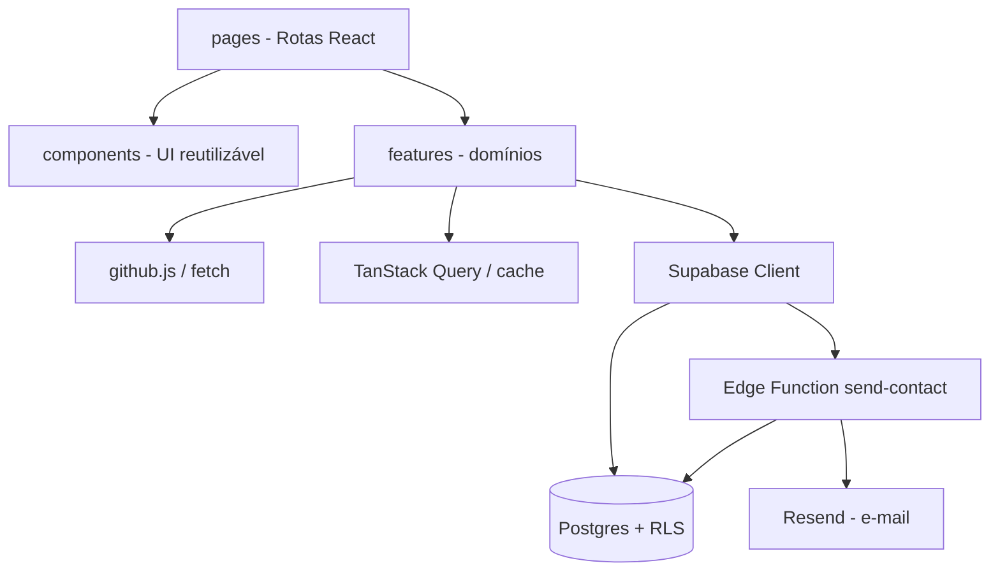
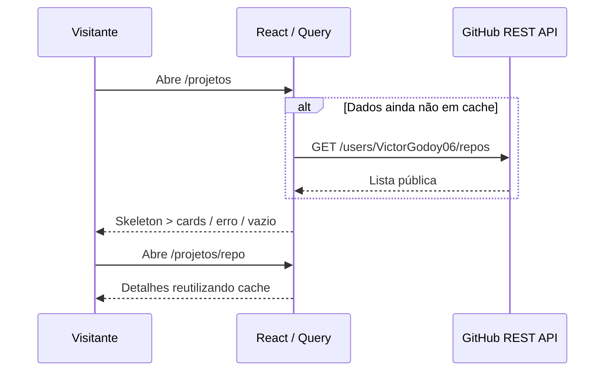
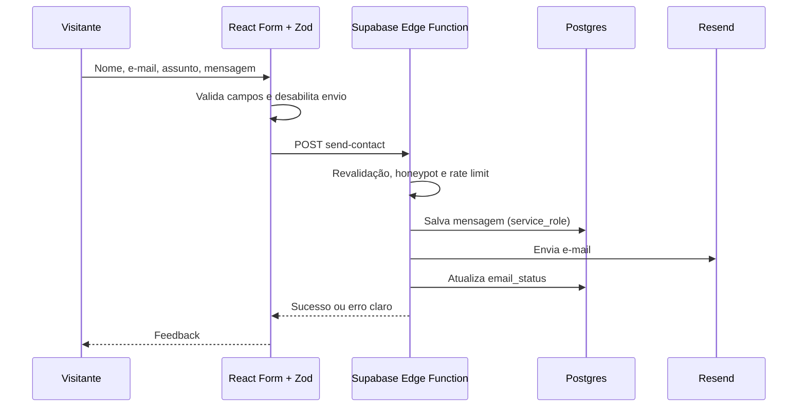
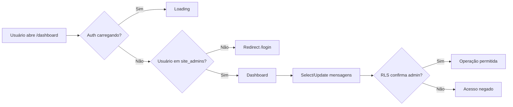

# Diagramas de arquitetura e fluxo de dados

## Camadas

```mermaid
flowchart TB
    P[pages - Rotas React] --> C[components - UI reutilizável]
    P --> F[features - domínios]
    F --> GH[github.js / fetch]
    F --> Q[TanStack Query / cache]
    F --> SB[Supabase Client]
    SB --> DB[(Postgres + RLS)]
    SB --> EF[Edge Function send-contact]
    EF --> DB
    EF --> RE[Resend - e-mail]
```

## Projetos públicos

```mermaid
sequenceDiagram
  participant V as Visitante
  participant R as React / Query
  participant G as GitHub REST API
  V->>R: Abre /projetos
  alt Dados ainda não em cache
    R->>G: GET /users/VictorGodoy06/repos
    G-->>R: Lista pública
  end
  R-->>V: Skeleton > cards / erro / vazio
  V->>R: Abre /projetos/repo
  R-->>V: Detalhes reutilizando cache
```

## Mensagem de contato

```mermaid
sequenceDiagram
  participant V as Visitante
  participant UI as React Form + Zod
  participant E as Supabase Edge Function
  participant DB as Postgres
  participant R as Resend
  V->>UI: Nome, e-mail, assunto, mensagem
  UI->>UI: Valida campos e desabilita envio
  UI->>E: POST send-contact
  E->>E: Revalidação, honeypot e rate limit
  E->>DB: Salva mensagem (service_role)
  E->>R: Envia e-mail
  E->>DB: Atualiza email_status
  E-->>UI: Sucesso ou erro claro
  UI-->>V: Feedback
```

## Autenticação e proteção

```mermaid
flowchart LR
  A[Usuário abre /dashboard] --> B{Auth carregando?}
  B -->|Sim| C[Loading]
  B -->|Não| D{Usuário em site_admins?}
  D -->|Não| E[Redirect /login]
  D -->|Sim| F[Dashboard]
  F --> G[Select/Update mensagens]
  G --> H{RLS confirma admin?}
  H -->|Sim| I[Operação permitida]
  H -->|Não| J[Acesso negado]
```
